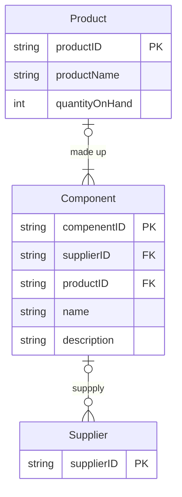

# 2019/2020 SEM1

## Q1

## Q2

## Q3

Business rules
1. `Product` are made up of many `components`
2. Each `component` can be supplied by one or more `supplier`
3. a `supplier` can exist without providing `component` ; hmm
4. a `component` does not have to be associated with a `supplier` : optional 
5. a `component` does not have to be associated with a `product` . Not all component are used in product : optional
6. a `product` cannot exist without a `component`  : mandatory

## Q4

Primary Key (Given)
- InvNo
- MedID

Partial Dependencies 
- InvNo --> InvDate , PatID 
- MedID --> MedName , Desc, Type, Price

Transitive Dependencies
- PatID --> PatName,PatAdd

1NF

Invitation

| InvNo | InvDate | PatID |
| ----- | ------- | ----- |

## Q5

### Q5 (a)

### Q5 (b)

### Q5 (c)

### Q5 (d)

### Q5 (e)

---

# 2018/2019 SEM1

## Q1

## Q2

## Q3

## Q4

## Q5

# 2016/2017

## Q1

## Q2

## Q3

## Q4

## Q5

