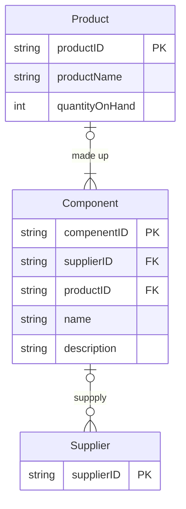
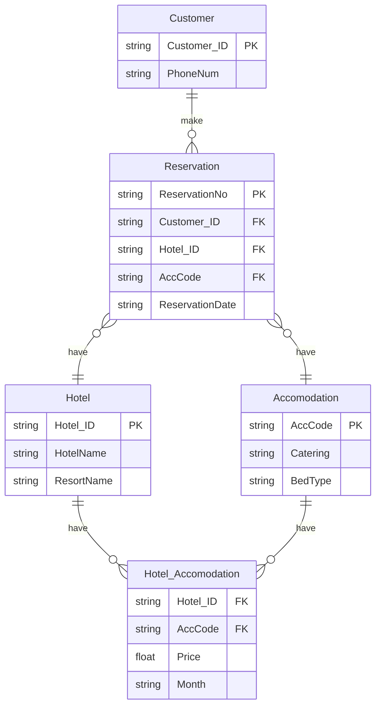

# 2019/2020 SEM1

## Q1


## Q2


## Q3

Business rules
1. `Product` are made up of many `components`
2. Each `component` can be supplied by one or more `supplier`
3. a `supplier` can exist without providing `component` ; hmm
4. a `component` does not have to be associated with a `supplier` : optional 
5. a `component` does not have to be associated with a `product` . Not all component are used in product : optional
6. a `product` cannot exist without a `component`  : mandatory




## Q4

Primary Key (Given)
- InvNo
- MedID

Partial Dependencies 
- InvNo --> InvDate , PatID 
- MedID --> MedName , Desc, Type, Price

Transitive Dependencies
- PatID --> PatName,PatAdd

1NF

| InvNo | InvDate | PatID | PatName | PatAdd | MedID | MedName | Desc | Type | Price |     |
| ----- | ------- | ----- | ------- | ------ | ----- | ------- | ---- | ---- | ----- | --- |

2NF

Invitation

| InvNo | InvDate | PatID | PatName | PatAdd |
| ----- | ------- | ----- | ------- | ------ |

Medication

| MedID | MedName | Desc | Type | Price |
| ----- | ------- | ---- | ---- | ----- |

3NF

Invitation

| InvNo | InvDate | PatID |
| ----- | ------- | ----- |

 Medication
 
| MedID | MedName | Desc | Type | Price |
| ----- | ------- | ---- | ---- | ----- |

 Patient

| PatID | PatName | PatAdd |
| ----- | ------- | ------ |
 
 

## Q5


### Q5 (a)


| Iron            |
| --------------- |
| HomeGym         |
| Microwave Oven  |
| Cordless Drill  |
| Washing Machine |
| Stand Mixer     |
| Dishwasher      |

### Q5 (b)

```sql
UPDATE  CUSTOMER 
SET Street = '90A , Jln Kita 2'
WHERE CustNo = 524 ;
```

### Q5 (c)

```sql
SELECT CustNo , CustName , (CreditLimit - Balance) AS AvaiCre
FROM CUSTOMER 
WHERE CreditLimit > Balance;
```
### Q5 (d)

```sql
SELECT CUSTOMER.CustNo , CUSTOMER.CustName , AGENT.AgentNo , AGENT.FirstName , AGENT.LastName
FROM CUSTOMER 
LEFT JOIN AGENT ON CUSTOMER.AgentNo = AGENT.AgentNo
ORDER BY CustNo;
```
### Q5 (e)


```sql
SELECT AgentNo , Count(CustNo) AS NoOfCust , ROUND(Avg(Balance),2) AS AverageBal
FROM CUSTOMER
GROUP BY AgentNo
ORDER BY AgentNo ASC; 
```

---

# 2018/2019 SEM1

## Q1


## Q2


## Q3





## Q4


primary key : InvoiceNum , ItemNum

Partial Dependency
- CustomerNum --> CustLastName , CustFirstName , Street , City 
- ItemNum --> ItemDesc, Price , QtyShipped

Transitive Dependency 
- City --> Zip , State

3NF
Invoice

| InvoiceNum (PK) | CustNum (FK) | Date |
| --------------- | ------------ | ---- |

Invoice_Item

| InvoiceNum (PK,FK) | ItemNum (PK,FK) | QtyShipped |
| ------------------ | --------------- | ---------- |
Customer

| CustNum (PK) | CustLastName | CustFirstName | Street | City |
| ------------ | ------------ | ------------- | ------ | ---- |

City

| City (PK) | ZIP | State |
| --------- | --- | ----- |

> WHY HAS TO CREATE INVOICE_ITEM ?
> - because Item and Invoice is in many to many relationship

## Q5


```sql
SELECT * 
FROM EMPLOYEE 
WHERE SALARY BETWEEN 5000 AND 12000 
ORDER BY SALARY ASC;
```

```sql
SELECT *
FROM EMPLOYEE
WHERE DEPARTMENT_ID = 20 AND SALARY > 5000;
```

```sql
SELECT JOB_ID , COUNT(EMPLOYEE_ID) AS TOTAL_EMPLOYEE
FROM EMPLOYEE
GROUP BY JOB_ID;
```

```sql
SELECT EMPLOYEE.LAST_NAME , DEPARTMENTS.DEPARTMENT_NAME
FROM EMPLOYEE
LEFT JOIN DEPARTMENT
ON DEPARTMENT.DEPARTMENT_ID = EMPLOYEE.DEPARTMENT_ID;
```

```sql
SELECT EMPLOYEE_ID , LAST_NAME , SALARY 
FROM EMPLOYEE
WHERE SALARY > (SELECT AVG(SALARY) FROM EMPLOYEE );
```
# 2016/2017

## Q1


## Q2


## Q3


## Q4


1. **Insertion Anomaly**:
    
    - If a new dentist is added but has no patient appointments yet, there is no way to insert the dentist's information without leaving the patient-related fields (e.g., `No. Pesakit`, `Nama Pesakit`, etc.) blank, which violates database integrity.
2. **Deletion Anomaly**:
    
    - If `Che Putih (P100)` cancels their appointment, the record for `Ahmad Albab (S1011)` might be deleted entirely, resulting in the loss of information about the dentist and their association with `Bilik Surgeri S15`.
3. **Update Anomaly**:
    
    - If `Ahmad Albab` is assigned a different `Bilik Surgeri`, all rows referencing `S1011` need to be updated. If one record is missed, inconsistencies will arise in the data.

1NF
APPOINTMENT(`No. Staf`, Nama Dentist,` No. Pesakit`, Nama Pesakit, Tarikh , Masa , Bilik Surgery)

2NF
STAFF(`No. Staf`, Nama Dentist)
PESAKIT(`No. Pesakit`, Nama Pesakit)
APPOINTMENT(`AppointID` , No. Staf , No. Pesakit , Tarikh , Masa , Bilik Surgeri)

3NF
STAFF(`No. Staf`, Nama Dentist)
PESAKIT(`No. Pesakit`, Nama Pesakit)
APPOINTMENT(`AppointID` , No. Staf , No. Pesakit , Tarikh , Masa , Bilik Surgeri)

> No transitive so 2NF and 3NF is same
## Q5

The `SELECT` statement in SQL is used to query data from a database. Here’s an explanation of the functions of the clauses mentioned and any restrictions that may apply:

1. **FROM**: 
   - **Function**: The `FROM` clause specifies the table or tables from which to retrieve the data. It is a mandatory clause in a `SELECT` statement unless you are selecting from a dummy table (like `DUAL` in some databases) or using a `SELECT` statement without a table reference (e.g., `SELECT 1;`).
   - **Restrictions**: The table(s) specified must exist in the database. If joining multiple tables, you must ensure that the join conditions are correctly specified to avoid Cartesian products.

2. **WHERE**:
   - **Function**: The `WHERE` clause is used to filter records based on specified conditions. It allows you to select only those rows that satisfy the given criteria.
   - **Restrictions**: The conditions in the `WHERE` clause must be valid expressions that can be evaluated to true or false. You cannot use aggregate functions directly in the `WHERE` clause; for that, you would use the `HAVING` clause.

3. **GROUP BY**:
   - **Function**: The `GROUP BY` clause groups rows that have the same values in specified columns into aggregated data. It is often used with aggregate functions like `COUNT`, `SUM`, `AVG`, etc., to perform calculations on each group of rows.
   - **Restrictions**: When using `GROUP BY`, all columns in the `SELECT` list that are not aggregated must be included in the `GROUP BY` clause. This ensures that the grouping is unambiguous.

Each of these clauses plays a crucial role in constructing a `SELECT` statement to retrieve and manipulate data effectively.


```sql
CREATE TABLE HOTEL {
	hotelNo CHAR(5) PRIMARY KEY,
	hotelName VARCHAR(100) NOT NULL,
	city VARCHAR(50) NOT NULL,
};
```

```sql
SELECT *
FROM Hotel
WHERE city = 'London';
```

```sql
SELECT Count(ROOM.roomNo) AS NumOfRoom, ROOM.HotelNo
FROM ROOM 
INNER JOIN HOTEL ON HOTEL.hotelNo = ROOM.hotelNo 
WHERE HOTEL.city = 'London'
GROUP BY ROOM.HotelNo;
```

```sql
SELECT * 
FROM ROOM
WHERE type IN ('D','F') AND price < 40
ORDER BY price ASC;
```